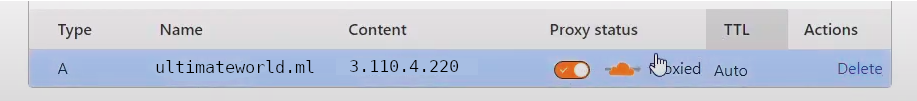

.. include:: <isonum.txt>

***************************************
Hosting: Django on AWS (using dokku)
***************************************

Hosting django server on AWS-EC2 Instance using Ubuntu/Linux Distro (Full guide) 
==========================================================================================

This guide is to host Django server on AWS using DOKKU (a open-source dockarized herokuish container).

Step 1 - AWS Instance Configuration
----------------------------------------------------

This is one of the ways you could configure your dokku AWS server so take this not as instruction but as a guide for setup.

* Go to https://aws.amazon.com/.

* Click on Sign in to the Console button and login into your AWS Account. 

* Go to Services -> Compute -> EC2 -> Launch Instance.

* Configurations:
    * Name : my-app-django
    * Application: Ubuntu
    * Instance type: t2.micro ( free tier )
    * Key pair(login): Generate key pair (if you haven't) and save the .pem file.
        .. image:: ../../_static/django_with_aws_keypair.png
            :width: 400
            :alt: django_keypair_aws
    * Network settings (Important):
        * Select Allow SSH traffic from anywhere. 
        * Allow HTTPs traffic from the internet
        * Allow HTTP traffic from the internet
    * Configure Storage: 12 GiB gp2 (recommended) but 10 GiB gp2 should work too.

* Click on Launch Instance.

Before connecting to the EC2 instance you may want to associate a static IP to the instance so if you need to restart the instance you will still retain the same IP.

(Optional) Elastic IP
************************************

    * EC2 Dashboard -> Network & Security -> Elastic IPs.
    * Click on Allocate Elastic IP address -> Allocate.
    * Once the IP is allocated. Select the newly created Elastic IP & Click Actions->Associate Elastic IP Address
    * Choose the instance from Step 1. Click Associate.

Once the instance status is running. Select the instance and Actions-> Connect 

Step 2 - Connect to AWS Instance
--------------------------------------------

Select the instance and click Connect.
    .. image:: ../../_static/django_with_aws_connect.jpeg
        :width: 600
        :alt: django_keypair_aws

Copy the Public IP address from EC2 Instance Connect Tab

Now, Open terminal and change permissions on the .pem file from Step-1

.. code-block:: bash
    
    $ sudo chmod 400 your_ssh_key.pem

In the same folder, paste the copied public ip instead of <your_instance_public_ip>

.. code-block:: bash
    
    $ ssh -i "<your_ssh_key>.pem" ubuntu@<your_instance_public_ip>

you should see a prompt like:

.. code-block:: bash

    ubuntu@<your_instance_public_ip>:~$ 

Step 3 - Install and Configure Dokku
--------------------------------------------

You will need generate your public/private ssh-keys in a new local terminal:

.. code-block:: bash

    $ ssh-keygen

* Go to https://dokku.com/ and run the commands show in the Quick Start instructions one by one.

    .. figure:: ../../_static/django_with_aws_dokku_quickstart.jpeg
        :width: 600
        :alt: django_keypair_aws
        
        May be different in future versions of dokku.

* For command: *echo "your-public-key-contents-here" | dokku ssh-keys:add admin*

    Copy the contents of ~/.ssh/id_rsa.pub file and replace "your-public-key-contents-here" with it.

* Finally create an app:

.. code-block:: bash

    $ dokku apps:create <dokku_app_name>

Step 4: Prepare the Django Project for dokku/heroku
---------------------------------------------------------------

Once we have everything configured we can connect django backend with dokku.

* Open a terminal and run

.. code-block:: bash

    $ cd path/to/django_project
    $ source venv/bin/activate  # activate venv which ever you are using

Install gunicorn and create requirements.txt and Procfile.
*****************************************************************************************

.. code-block:: bash

    $ pip install gunicorn
    $ pip freeze > requirements.txt
    $ echo 'web: gunicorn <django_app_name>.wsgi' > Procfile

(Recommended) Specify runtime
************************************
Create a runtime.txt in project's root folder to specify python version.

.. code-block:: bash

    $ echo 'python-3.10.6' > runtime.txt

Step 5 - Connecting your source with dokku
------------------------------------------------

.. code-block:: bash

    $ git init
    $ git remote add dokku dokku@<your_instance_public_ip>:<dokku_app_name>
    $ git add .
    $ git commit -m "init"
    $ git push dokku <master/main>

(Optional, Recommended) Step 6 - Using postgres on Dokku and Local
------------------------------------------------------------------------

    `Dokku: Using Postgres as database </en/latest/content/django/dokku_postgres.html>`_
    
    `Local: Using Postgres as database </en/latest/content/django/local_postgres.html>`_

Step 6: Configuring Domain Name or IP address
---------------------------------------------------------------

Connect to remote instance with SSH as in Step-2

And check the domain configurations.

.. code-block:: bash

    $ dokku domains:report

if there are domains preconfigured remove all domains (global and app-specific) using

.. code-block:: bash

    $ dokku domains:remove-global <domain>
    $ dokku domains:remove <app_name> <domain>

And then set it to instance IP address or a domain if you have bought from a Domain Name Provider.

To set IP Address
--------------------

.. code-block:: bash
    
    $ dokku domains:add-global <public_IP_address>
    $ dokku domains:add <app_name> <public_IP_address>

Your app should now be visible at http://public_IP_address

To set Domain name
------------------------

Configure an A record in your DNS configuration on you Domain name providers site.

and in your instance set the domain names like:
    
.. code-block:: bash
    
    $ dokku domains:add-global <domain_name>
    $ dokku domains:add <app_name> <domain_name>

Your app should now be visible at http://domain.domain_name

Hurray your app is hosted online for public to see.

Thanks for reading. I hope this was of help to you.